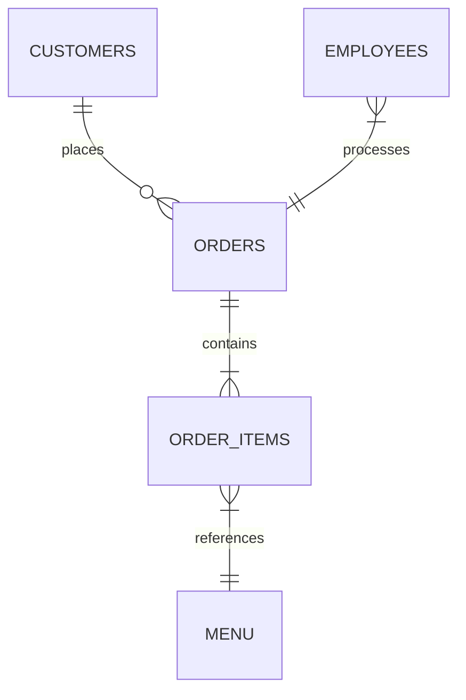
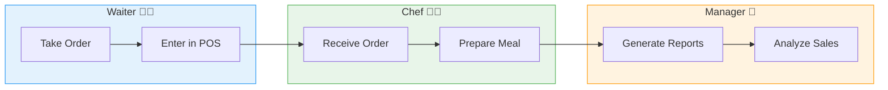
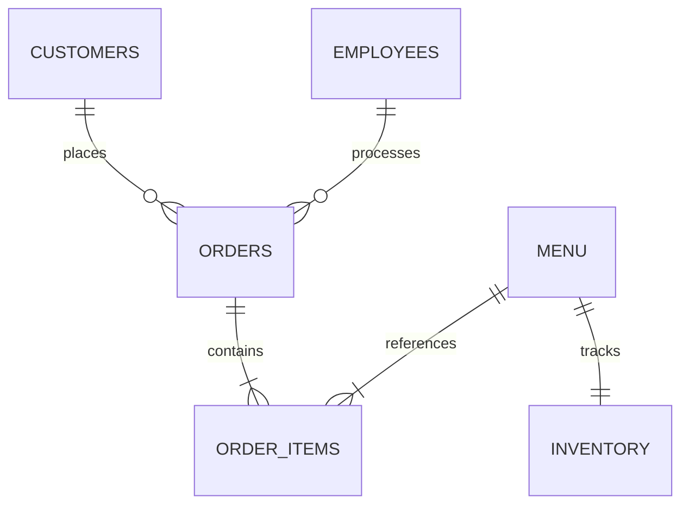

# 🍽️ PL/SQL Capstone Project - Final Exam
**Project Title:** Small Restaurant Order Management System  
**Student:** Christian | **ID:** 27491 | **Group:** Wednesday  
**Course:** INSY 8311 - Database Development with PL/SQL  
**Supervisor:** Eric Maniraguha  


---

## 📝 Problem Statement-Phase I 

### 🎯 **Project Objective**  
Develop an Oracle PL/SQL-based system to:  
- ✅ Automate order tracking for small restaurants  
- ✅ Streamline menu management and billing  
- ✅ Reduce human errors by 50%+  
- ✅ Improve customer service through real-time order updates  

### 🌍 **Context**  
**Target Environment:**  
Busy urban restaurants with 10+ daily orders struggling with:  
- 📜 Paper-based order management  
- ⏳ Delays in kitchen-order communication  
- 💸 Billing discrepancies  

### 👥 **Stakeholders**  
| Role               | Pain Points Solved                  |
|--------------------|-------------------------------------|
| **Waiters**        | Faster order submission via POS     |
| **Chefs**          | Real-time order queue visualization |
| **Managers**       | Automated sales analytics           |
| **Customers**      | Accurate bills & faster service     |

---

## 🔍 **Core System Components**  



# 🏗️ PL/SQL Capstone - Phase II: Business Process Modeling
**Adventist University of Central Africa**  
*Faculty of Information Technology | INSY 8311 - Database Development with PL/SQL*  
**Student:** Christian (ID: 27491) | **Group:** Wednesday  
**Deadline:** [Insert Date]  

---

## 📌 BPMN Diagram (Order Fulfillment Process)



# Business Process Documentation

## 1. System Flow
1. Order taken → POS entry → Kitchen display  
2. Payment processed → Inventory updated  
3. Report generated → Performance analyzed  

## 2. PL/SQL Integration
```sql
-- Sample trigger for Phase VII
CREATE TRIGGER trg_update_inventory
AFTER INSERT ON order_items
FOR EACH ROW
BEGIN
    UPDATE inventory 
    SET stock = stock - :NEW.quantity
    WHERE item_id = :NEW.item_id;
END;
/
```

# 🧩 Phase III: Logical Model Design

## 🎯 Objective
This project addresses the order management challenges of small restaurants, including inefficient order tracking, menu management difficulties, and billing discrepancies. The logical model developed in this phase is based on the real-world needs outlined in Phase I and the process workflow modeled in Phase II.

Design a normalized, well-constrained, relational data model that accurately represents customers, orders, menu items, employees, and inventory for a small restaurant business.

---

## 🗃️ Entities & Attributes

### 🍽️ MENU
| Attribute   | Type           | Constraint |
|-------------|----------------|------------|
| ITEM_ID     | NUMBER         | Primary Key (Auto-generated) |
| NAME        | VARCHAR2(100)  | NOT NULL |
| PRICE       | NUMBER(6,2)    | NOT NULL, CHECK (PRICE > 0) |
| CATEGORY    | VARCHAR2(50)   | NOT NULL |
| AVAILABLE   | CHAR(1)        | DEFAULT 'Y', CHECK (AVAILABLE IN ('Y','N')) |
| CREATED_AT  | DATE           | DEFAULT SYSDATE |

```sql
CREATE TABLE menu (
    item_id NUMBER GENERATED ALWAYS AS IDENTITY PRIMARY KEY,
    name VARCHAR2(100) NOT NULL,
    price NUMBER(6,2) NOT NULL CHECK (price > 0),
    category VARCHAR2(50) NOT NULL,
    available CHAR(1) DEFAULT 'Y' CHECK (available IN ('Y','N')),
    created_at DATE DEFAULT SYSDATE
);
```

---

### 🧾 ORDERS
| Attribute     | Type           | Constraint |
|---------------|----------------|------------|
| ORDER_ID      | NUMBER         | Primary Key (Auto-generated) |
| CUSTOMER_ID   | NUMBER         | Foreign Key → CUSTOMERS |
| EMPLOYEE_ID   | NUMBER         | Foreign Key → EMPLOYEES |
| ORDER_TIME    | TIMESTAMP      | DEFAULT SYSTIMESTAMP |
| STATUS        | VARCHAR2(20)   | DEFAULT 'RECEIVED' |
| TOTAL_AMOUNT  | NUMBER(8,2)    | DEFAULT 0 |

```sql
CREATE TABLE orders (
    order_id NUMBER GENERATED ALWAYS AS IDENTITY PRIMARY KEY,
    customer_id NUMBER NOT NULL,
    employee_id NUMBER NOT NULL,
    order_time TIMESTAMP DEFAULT SYSTIMESTAMP,
    status VARCHAR2(20) DEFAULT 'RECEIVED',
    total_amount NUMBER(8,2) DEFAULT 0,
    CONSTRAINT fk_customer FOREIGN KEY (customer_id) REFERENCES customers(customer_id),
    CONSTRAINT fk_employee FOREIGN KEY (employee_id) REFERENCES employees(employee_id)
);
```

---

### 👥 CUSTOMERS
| Attribute   | Type           | Constraint |
|-------------|----------------|------------|
| CUSTOMER_ID | NUMBER         | Primary Key (Auto-generated) |
| NAME        | VARCHAR2(50)   | NOT NULL |
| PHONE       | VARCHAR2(15)   | UNIQUE |
| EMAIL       | VARCHAR2(100)  | - |
| JOIN_DATE   | DATE           | DEFAULT SYSDATE |

```sql
CREATE TABLE customers (
    customer_id NUMBER GENERATED ALWAYS AS IDENTITY PRIMARY KEY,
    name VARCHAR2(50) NOT NULL,
    phone VARCHAR2(15) UNIQUE,
    email VARCHAR2(100),
    join_date DATE DEFAULT SYSDATE
);
```

---

### 👨🍳 EMPLOYEES
| Attribute   | Type           | Constraint |
|-------------|----------------|------------|
| EMPLOYEE_ID | NUMBER         | Primary Key (Auto-generated) |
| NAME        | VARCHAR2(50)   | NOT NULL |
| POSITION    | VARCHAR2(20)   | NOT NULL |
| HIRE_DATE   | DATE           | DEFAULT SYSDATE |
| ACTIVE      | CHAR(1)        | DEFAULT 'Y', CHECK (ACTIVE IN ('Y','N')) |

```sql
CREATE TABLE employees (
    employee_id NUMBER GENERATED ALWAYS AS IDENTITY PRIMARY KEY,
    name VARCHAR2(50) NOT NULL,
    position VARCHAR2(20) NOT NULL,
    hire_date DATE DEFAULT SYSDATE,
    active CHAR(1) DEFAULT 'Y' CHECK (active IN ('Y','N'))
);
```

---

### 🛒 ORDER_ITEMS (Junction Table)
| Attribute      | Type           | Constraint |
|----------------|----------------|------------|
| ORDER_ITEM_ID  | NUMBER         | Primary Key (Auto-generated) |
| ORDER_ID       | NUMBER         | Foreign Key → ORDERS |
| ITEM_ID        | NUMBER         | Foreign Key → MENU |
| QUANTITY       | NUMBER         | NOT NULL, CHECK (QUANTITY > 0) |
| UNIT_PRICE     | NUMBER(6,2)    | NOT NULL |

```sql
CREATE TABLE order_items (
    order_item_id NUMBER GENERATED ALWAYS AS IDENTITY PRIMARY KEY,
    order_id NUMBER NOT NULL,
    item_id NUMBER NOT NULL,
    quantity NUMBER NOT NULL CHECK (quantity > 0),
    unit_price NUMBER(6,2) NOT NULL,
    CONSTRAINT fk_order FOREIGN KEY (order_id) REFERENCES orders(order_id),
    CONSTRAINT fk_menu_item FOREIGN KEY (item_id) REFERENCES menu(item_id)
);
```

---

### 📦 INVENTORY
| Attribute       | Type           | Constraint |
|------------------|----------------|------------|
| INVENTORY_ID     | NUMBER         | Primary Key (Auto-generated) |
| ITEM_ID          | NUMBER         | Foreign Key → MENU, UNIQUE |
| CURRENT_STOCK    | NUMBER         | DEFAULT 0, CHECK (CURRENT_STOCK >= 0) |
| REORDER_LEVEL    | NUMBER         | DEFAULT 5 |
| LAST_UPDATE      | DATE           | DEFAULT SYSDATE |

```sql
CREATE TABLE inventory (
    inventory_id NUMBER GENERATED ALWAYS AS IDENTITY PRIMARY KEY,
    item_id NUMBER NOT NULL UNIQUE,
    current_stock NUMBER DEFAULT 0 CHECK (current_stock >= 0),
    reorder_level NUMBER DEFAULT 5,
    last_update DATE DEFAULT SYSDATE,
    CONSTRAINT fk_menu_item_inv FOREIGN KEY (item_id) REFERENCES menu(item_id)
);
```

---

## 🔄 Relationships & Constraints

- 👥 CUSTOMERS ↔ ORDERS — One-to-Many  
- 👨🍳 EMPLOYEES ↔ ORDERS — One-to-Many  
- 🍽️ MENU ↔ ORDER_ITEMS — One-to-Many  
- 🧾 ORDERS ↔ ORDER_ITEMS — One-to-Many  
- 🍽️ MENU ↔ INVENTORY — One-to-One  

**Key Constraints:**
- ✅ Foreign keys ensure data integrity  
- ✅ CHECK constraints enforce valid quantities and prices  
- ✅ DEFAULT values improve usability  
- ✅ UNIQUE constraints prevent duplicate customer contacts  

---

## 📐 Normalization (3NF Verified)
- ✅ **1NF** – All attributes contain atomic values  
- ✅ **2NF** – No partial dependencies  
- ✅ **3NF** – Eliminated transitive dependencies  

---

## 🧪 Real-World Scenario Coverage

| Scenario                          | Supported |
|----------------------------------|-----------|
| Take customer orders             | ✅         |
| Track menu items with prices     | ✅         |
| Manage inventory levels          | ✅         |
| Handle orders with multiple items| ✅         |
| Prevent invalid orders           | ✅         |
| Track which employee took order  | ✅         |
| Generate accurate bills          | ✅         |

---

## 🖼️ ERD Diagram

## 🖼️ ERD Diagram (Mermaid Syntax)

```mermaid
erDiagram
    CUSTOMERS {
        NUMBER customer_id PK
        VARCHAR2(50) name
        VARCHAR2(15) phone
        VARCHAR2(100) email
        DATE join_date
    }
    
    EMPLOYEES {
        NUMBER employee_id PK
        VARCHAR2(50) name
        VARCHAR2(20) position
        DATE hire_date
        CHAR(1) active
    }
    
    MENU {
        NUMBER item_id PK
        VARCHAR2(100) name
        NUMBER(6,2) price
        VARCHAR2(50) category
        CHAR(1) available
    }
    
    ORDERS {
        NUMBER order_id PK
        NUMBER customer_id FK
        NUMBER employee_id FK
        TIMESTAMP order_time
        VARCHAR2(20) status
        NUMBER(8,2) total_amount
    }
    
    ORDER_ITEMS {
        NUMBER order_item_id PK
        NUMBER order_id FK
        NUMBER item_id FK
        NUMBER quantity
        NUMBER(6,2) unit_price
    }
    
    INVENTORY {
        NUMBER inventory_id PK
        NUMBER item_id FK
        NUMBER current_stock
        NUMBER reorder_level
    }
    
    CUSTOMERS ||--o{ ORDERS : "places"
    EMPLOYEES ||--o{ ORDERS : "processes"
    ORDERS ||--|{ ORDER_ITEMS : "contains"
    MENU ||--|{ ORDER_ITEMS : "references"
    MENU ||--|| INVENTORY : "tracks"
```


**Screenshots Folder:**  
- 📷 `./screenshots/phase_III/`

```markdown

```

---

## 💻 SQL Script Location

📁 `/sql/phase_III_create_tables.sql`  
Contains complete DDL for all tables with constraints and relationships.


## 🎯 Objective
Design a normalized, well-constrained relational data model for the Small Restaurant Order Management System that:
- Tracks customers, orders, menu items, and inventory
- Ensures data integrity through constraints
- Supports all business processes identified in Phase II
- Adheres to 3rd Normal Form (3NF)

## 🗃️ Core Entities

### 🍽️ MENU
```sql
CREATE TABLE menu (
    item_id NUMBER GENERATED ALWAYS AS IDENTITY PRIMARY KEY,
    name VARCHAR2(100) NOT NULL,
    price NUMBER(6,2) NOT NULL CHECK (price > 0),
    category VARCHAR2(50) NOT NULL,
    available CHAR(1) DEFAULT 'Y' CHECK (available IN ('Y','N')),
    created_at DATE DEFAULT SYSDATE
);
``` 
### 🧾 ORDERS
```sql
CREATE TABLE orders (
    order_id NUMBER GENERATED ALWAYS AS IDENTITY PRIMARY KEY,
    customer_id NUMBER NOT NULL,
    employee_id NUMBER NOT NULL,
    order_time TIMESTAMP DEFAULT SYSTIMESTAMP,
    status VARCHAR2(20) DEFAULT 'RECEIVED',
    total_amount NUMBER(8,2) DEFAULT 0,
    CONSTRAINT fk_customer FOREIGN KEY (customer_id) REFERENCES customers(customer_id),
    CONSTRAINT fk_employee FOREIGN KEY (employee_id) REFERENCES employees(employee_id)
);
```
### 👥 CUSTOMERS
```sql
CREATE TABLE customers (
    customer_id NUMBER GENERATED ALWAYS AS IDENTITY PRIMARY KEY,
    name VARCHAR2(50) NOT NULL,
    phone VARCHAR2(15) UNIQUE,
    email VARCHAR2(100),
    join_date DATE DEFAULT SYSDATE
);
```
### 👨🍳 EMPLOYEES
```sql
CREATE TABLE employees (
    employee_id NUMBER GENERATED ALWAYS AS IDENTITY PRIMARY KEY,
    name VARCHAR2(50) NOT NULL,
    position VARCHAR2(20) NOT NULL,
    hire_date DATE DEFAULT SYSDATE,
    active CHAR(1) DEFAULT 'Y' CHECK (active IN ('Y','N'))
);
```
### 🛒 ORDER_ITEMS
```sql
CREATE TABLE order_items (
    order_item_id NUMBER GENERATED ALWAYS AS IDENTITY PRIMARY KEY,
    order_id NUMBER NOT NULL,
    item_id NUMBER NOT NULL,
    quantity NUMBER NOT NULL CHECK (quantity > 0),
    unit_price NUMBER(6,2) NOT NULL,
    CONSTRAINT fk_order FOREIGN KEY (order_id) REFERENCES orders(order_id),
    CONSTRAINT fk_menu_item FOREIGN KEY (item_id) REFERENCES menu(item_id)
);
```
### 📦 INVENTORY
```sql
CREATE TABLE inventory (
    inventory_id NUMBER GENERATED ALWAYS AS IDENTITY PRIMARY KEY,
    item_id NUMBER NOT NULL UNIQUE,
    current_stock NUMBER DEFAULT 0 CHECK (current_stock >= 0),
    reorder_level NUMBER DEFAULT 5,
    last_update DATE DEFAULT SYSDATE,
    CONSTRAINT fk_menu_item_inv FOREIGN KEY (item_id) REFERENCES menu(item_id)
);
```

    
