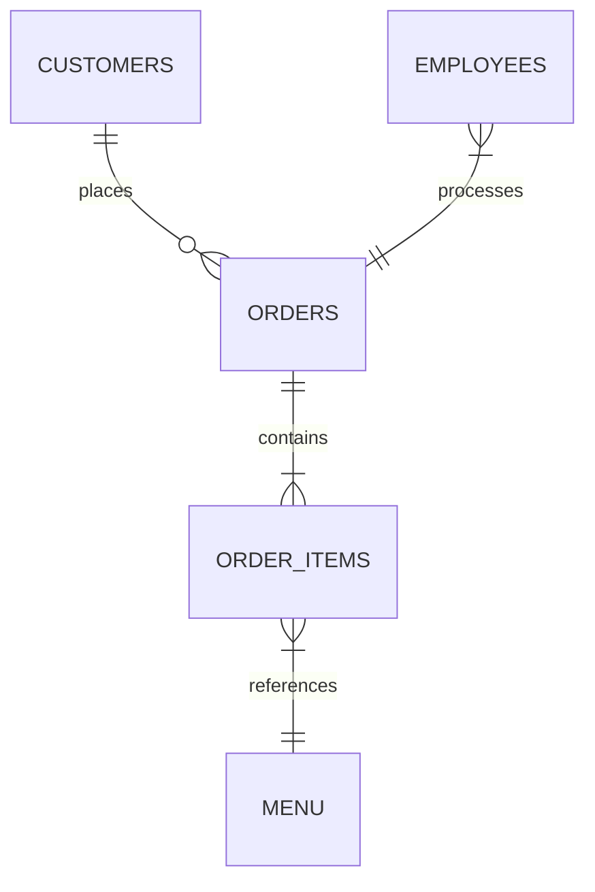
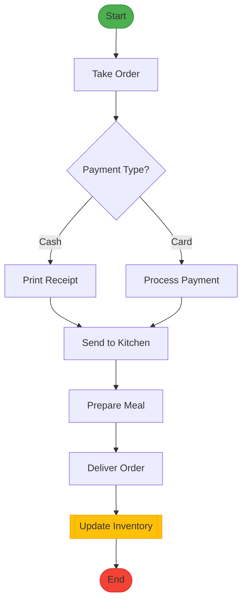

# 🍽️ PL/SQL Capstone Project - Final Exam
**Project Title:** Small Restaurant Order Management System  
**Student:** Christian | **ID:** 27491 | **Group:** Wednesday  
**Course:** INSY 8311 - Database Development with PL/SQL  
**Supervisor:** Eric Maniraguha  


---

## 📝 Problem Statement-Phase I 

### 🎯 **Project Objective**  
Develop an Oracle PL/SQL-based system to:  
- ✅ Automate order tracking for small restaurants  
- ✅ Streamline menu management and billing  
- ✅ Reduce human errors by 50%+  
- ✅ Improve customer service through real-time order updates  

### 🌍 **Context**  
**Target Environment:**  
Busy urban restaurants with 10+ daily orders struggling with:  
- 📜 Paper-based order management  
- ⏳ Delays in kitchen-order communication  
- 💸 Billing discrepancies  

### 👥 **Stakeholders**  
| Role               | Pain Points Solved                  |
|--------------------|-------------------------------------|
| **Waiters**        | Faster order submission via POS     |
| **Chefs**          | Real-time order queue visualization |
| **Managers**       | Automated sales analytics           |
| **Customers**      | Accurate bills & faster service     |

---

## 🔍 **Core System Components**  



## 📌 Core Deliverables  

### 1. BPMN Diagram (Order Fulfillment)  

````markdown
```mermaid
flowchart TD
    A([Start]) --> B[Take Order]
    B --> C{Payment Type?}
    C -->|Cash| D[Print Receipt]
    C -->|Card| E[Process Payment]
    D --> F[Send to Kitchen]
    E --> F
    F --> G[Prepare Meal]
    G --> H[Deliver Order]
    H --> I[[Update Inventory]]
    I --> J([End])
    
    style A fill:#4CAF50,stroke:#388E3C
    style J fill:#F44336,stroke:#D32F2F
    style I fill:#FFC107,stroke:#FFA000

**Key MIS Integration Points:**  
- `Update Inventory` → Oracle trigger (Phase VII prep)  
- `Process Payment` → PL/SQL procedure  

---

### 2. Swimlane Diagram (Roles & Responsibilities)  
**Mermaid Code:**  
````markdown
```mermaid
flowchart LR
    subgraph Waiter
        A[Take Order] --> B[POS Input]
    end
    subgraph Chef
        C[Receive Order] --> D[Prepare Meal]
    end
    subgraph Manager
        E[Approve Discounts] --> F[Generate Reports]
    end
    B --> C
    D --> E
```
---
## 1. BPMN Diagram (Order Fulfillment)

