# 🍽️ PL/SQL Capstone Project - Final Exam
**Project Title:** Small Restaurant Order Management System  
**Student:** Christian | **ID:** 27491 | **Group:** Wednesday  
**Course:** INSY 8311 - Database Development with PL/SQL  
**Supervisor:** Eric Maniraguha  


---

## 📝 Problem Statement-Phase I 

### 🎯 **Project Objective**  
Develop an Oracle PL/SQL-based system to:  
- ✅ Automate order tracking for small restaurants  
- ✅ Streamline menu management and billing  
- ✅ Reduce human errors by 50%+  
- ✅ Improve customer service through real-time order updates  

### 🌍 **Context**  
**Target Environment:**  
Busy urban restaurants with 10+ daily orders struggling with:  
- 📜 Paper-based order management  
- ⏳ Delays in kitchen-order communication  
- 💸 Billing discrepancies  

### 👥 **Stakeholders**  
| Role               | Pain Points Solved                  |
|--------------------|-------------------------------------|
| **Waiters**        | Faster order submission via POS     |
| **Chefs**          | Real-time order queue visualization |
| **Managers**       | Automated sales analytics           |
| **Customers**      | Accurate bills & faster service     |

---

## 🔍 **Core System Components**  


## 🏗️ PL/SQL Capstone - Phase II: Business Process Modeling
**Adventist University of Central Africa**  
*Faculty of Information Technology | INSY 8311 - Database Development with PL/SQL*  
**Student:** Christian (ID: 27491) | **Group:** Wednesday  
**Deadline:** [Insert Date]  

---

### 📌 BPMN Diagram (Order Fulfillment Process)

```mermaid
flowchart LR
    subgraph Waiter["Waiter 🧑🍳"]
        A[Take Order] --> B[Enter in POS]
    end
    
    subgraph Chef["Chef 👨🍳"]
        C[Receive Order] --> D[Prepare Meal]
    end
    
    subgraph Manager["Manager 💼"]
        E[Generate Reports] --> F[Analyze Sales]
    end
    
    B --> C
    D --> E
    
    style Waiter fill:#E3F2FD,stroke:#2196F3
    style Chef fill:#E8F5E9,stroke:#4CAF50
    style Manager fill:#FFF3E0,stroke:#FF9800
    ```
    ```

```



## Business Process Documentation

## 1. System Flow
1. Order taken → POS entry → Kitchen display  
2. Payment processed → Inventory updated  
3. Report generated → Performance analyzed  

## 2. PL/SQL Integration
```sql
-- Sample trigger for Phase VII
CREATE TRIGGER trg_update_inventory
AFTER INSERT ON order_items
FOR EACH ROW
BEGIN
    UPDATE inventory 
    SET stock = stock - :NEW.quantity
    WHERE item_id = :NEW.item_id;
END;
/
```

## 🧩 Phase III: Logical Model Design

### 🎯 Objective
This project addresses the order management challenges of small restaurants, including inefficient order tracking, menu management difficulties, and billing discrepancies. The logical model developed in this phase is based on the real-world needs outlined in Phase I and the process workflow modeled in Phase II.

Design a normalized, well-constrained, relational data model that accurately represents customers, orders, menu items, employees, and inventory for a small restaurant business.

---

### 🗃️ Entities & Attributes

### 🍽️ MENU
| Attribute   | Type           | Constraint |
|-------------|----------------|------------|
| ITEM_ID     | NUMBER         | Primary Key (Auto-generated) |
| NAME        | VARCHAR2(100)  | NOT NULL |
| PRICE       | NUMBER(6,2)    | NOT NULL, CHECK (PRICE > 0) |
| CATEGORY    | VARCHAR2(50)   | NOT NULL |
| AVAILABLE   | CHAR(1)        | DEFAULT 'Y', CHECK (AVAILABLE IN ('Y','N')) |
| CREATED_AT  | DATE           | DEFAULT SYSDATE |

```sql
CREATE TABLE menu (
    item_id NUMBER GENERATED ALWAYS AS IDENTITY PRIMARY KEY,
    name VARCHAR2(100) NOT NULL,
    price NUMBER(6,2) NOT NULL CHECK (price > 0),
    category VARCHAR2(50) NOT NULL,
    available CHAR(1) DEFAULT 'Y' CHECK (available IN ('Y','N')),
    created_at DATE DEFAULT SYSDATE
);
```

---

### 🧾 ORDERS
| Attribute     | Type           | Constraint |
|---------------|----------------|------------|
| ORDER_ID      | NUMBER         | Primary Key (Auto-generated) |
| CUSTOMER_ID   | NUMBER         | Foreign Key → CUSTOMERS |
| EMPLOYEE_ID   | NUMBER         | Foreign Key → EMPLOYEES |
| ORDER_TIME    | TIMESTAMP      | DEFAULT SYSTIMESTAMP |
| STATUS        | VARCHAR2(20)   | DEFAULT 'RECEIVED' |
| TOTAL_AMOUNT  | NUMBER(8,2)    | DEFAULT 0 |

```sql
CREATE TABLE orders (
    order_id NUMBER GENERATED ALWAYS AS IDENTITY PRIMARY KEY,
    customer_id NUMBER NOT NULL,
    employee_id NUMBER NOT NULL,
    order_time TIMESTAMP DEFAULT SYSTIMESTAMP,
    status VARCHAR2(20) DEFAULT 'RECEIVED',
    total_amount NUMBER(8,2) DEFAULT 0,
    CONSTRAINT fk_customer FOREIGN KEY (customer_id) REFERENCES customers(customer_id),
    CONSTRAINT fk_employee FOREIGN KEY (employee_id) REFERENCES employees(employee_id)
);
```

---

### 👥 CUSTOMERS
| Attribute   | Type           | Constraint |
|-------------|----------------|------------|
| CUSTOMER_ID | NUMBER         | Primary Key (Auto-generated) |
| NAME        | VARCHAR2(50)   | NOT NULL |
| PHONE       | VARCHAR2(15)   | UNIQUE |
| EMAIL       | VARCHAR2(100)  | - |
| JOIN_DATE   | DATE           | DEFAULT SYSDATE |

```sql
CREATE TABLE customers (
    customer_id NUMBER GENERATED ALWAYS AS IDENTITY PRIMARY KEY,
    name VARCHAR2(50) NOT NULL,
    phone VARCHAR2(15) UNIQUE,
    email VARCHAR2(100),
    join_date DATE DEFAULT SYSDATE
);
```

---

### 👨🍳 EMPLOYEES
| Attribute   | Type           | Constraint |
|-------------|----------------|------------|
| EMPLOYEE_ID | NUMBER         | Primary Key (Auto-generated) |
| NAME        | VARCHAR2(50)   | NOT NULL |
| POSITION    | VARCHAR2(20)   | NOT NULL |
| HIRE_DATE   | DATE           | DEFAULT SYSDATE |
| ACTIVE      | CHAR(1)        | DEFAULT 'Y', CHECK (ACTIVE IN ('Y','N')) |

```sql
CREATE TABLE employees (
    employee_id NUMBER GENERATED ALWAYS AS IDENTITY PRIMARY KEY,
    name VARCHAR2(50) NOT NULL,
    position VARCHAR2(20) NOT NULL,
    hire_date DATE DEFAULT SYSDATE,
    active CHAR(1) DEFAULT 'Y' CHECK (active IN ('Y','N'))
);
```

---

### 🛒 ORDER_ITEMS (Junction Table)
| Attribute      | Type           | Constraint |
|----------------|----------------|------------|
| ORDER_ITEM_ID  | NUMBER         | Primary Key (Auto-generated) |
| ORDER_ID       | NUMBER         | Foreign Key → ORDERS |
| ITEM_ID        | NUMBER         | Foreign Key → MENU |
| QUANTITY       | NUMBER         | NOT NULL, CHECK (QUANTITY > 0) |
| UNIT_PRICE     | NUMBER(6,2)    | NOT NULL |

```sql
CREATE TABLE order_items (
    order_item_id NUMBER GENERATED ALWAYS AS IDENTITY PRIMARY KEY,
    order_id NUMBER NOT NULL,
    item_id NUMBER NOT NULL,
    quantity NUMBER NOT NULL CHECK (quantity > 0),
    unit_price NUMBER(6,2) NOT NULL,
    CONSTRAINT fk_order FOREIGN KEY (order_id) REFERENCES orders(order_id),
    CONSTRAINT fk_menu_item FOREIGN KEY (item_id) REFERENCES menu(item_id)
);
```

---

### 📦 INVENTORY
| Attribute       | Type           | Constraint |
|------------------|----------------|------------|
| INVENTORY_ID     | NUMBER         | Primary Key (Auto-generated) |
| ITEM_ID          | NUMBER         | Foreign Key → MENU, UNIQUE |
| CURRENT_STOCK    | NUMBER         | DEFAULT 0, CHECK (CURRENT_STOCK >= 0) |
| REORDER_LEVEL    | NUMBER         | DEFAULT 5 |
| LAST_UPDATE      | DATE           | DEFAULT SYSDATE |

```sql
CREATE TABLE inventory (
    inventory_id NUMBER GENERATED ALWAYS AS IDENTITY PRIMARY KEY,
    item_id NUMBER NOT NULL UNIQUE,
    current_stock NUMBER DEFAULT 0 CHECK (current_stock >= 0),
    reorder_level NUMBER DEFAULT 5,
    last_update DATE DEFAULT SYSDATE,
    CONSTRAINT fk_menu_item_inv FOREIGN KEY (item_id) REFERENCES menu(item_id)
);
```

---

### 🔄 Relationships & Constraints

- 👥 CUSTOMERS ↔ ORDERS — One-to-Many  
- 👨🍳 EMPLOYEES ↔ ORDERS — One-to-Many  
- 🍽️ MENU ↔ ORDER_ITEMS — One-to-Many  
- 🧾 ORDERS ↔ ORDER_ITEMS — One-to-Many  
- 🍽️ MENU ↔ INVENTORY — One-to-One  

**Key Constraints:**
- ✅ Foreign keys ensure data integrity  
- ✅ CHECK constraints enforce valid quantities and prices  
- ✅ DEFAULT values improve usability  
- ✅ UNIQUE constraints prevent duplicate customer contacts  

---

### 📐 Normalization (3NF Verified)
- ✅ **1NF** – All attributes contain atomic values  
- ✅ **2NF** – No partial dependencies  
- ✅ **3NF** – Eliminated transitive dependencies  

---

### 🧪 Real-World Scenario Coverage

| Scenario                          | Supported |
|----------------------------------|-----------|
| Take customer orders             | ✅         |
| Track menu items with prices     | ✅         |
| Manage inventory levels          | ✅         |
| Handle orders with multiple items| ✅         |
| Prevent invalid orders           | ✅         |
| Track which employee took order  | ✅         |
| Generate accurate bills          | ✅         |

---

### 🖼️ ERD Diagram

### 🖼️ ERD Diagram (Mermaid Syntax)


**Screenshots Folder:**  
- 📷 `./screenshots/phase_III/`

```markdown

```

---

### 💻 SQL Script Location

📁 `/sql/phase_III_create_tables.sql`  
Contains complete DDL for all tables with constraints and relationships.


### 🎯 Objective
Design a normalized, well-constrained relational data model for the Small Restaurant Order Management System that:
- Tracks customers, orders, menu items, and inventory
- Ensures data integrity through constraints
- Supports all business processes identified in Phase II
- Adheres to 3rd Normal Form (3NF)

### 🗃️ Core Entities

#### 🍽️ MENU
```sql
CREATE TABLE menu (
    item_id NUMBER GENERATED ALWAYS AS IDENTITY PRIMARY KEY,
    name VARCHAR2(100) NOT NULL,
    price NUMBER(6,2) NOT NULL CHECK (price > 0),
    category VARCHAR2(50) NOT NULL,
    available CHAR(1) DEFAULT 'Y' CHECK (available IN ('Y','N')),
    created_at DATE DEFAULT SYSDATE
);
``` 
### 🧾 ORDERS
```sql
CREATE TABLE orders (
    order_id NUMBER GENERATED ALWAYS AS IDENTITY PRIMARY KEY,
    customer_id NUMBER NOT NULL,
    employee_id NUMBER NOT NULL,
    order_time TIMESTAMP DEFAULT SYSTIMESTAMP,
    status VARCHAR2(20) DEFAULT 'RECEIVED',
    total_amount NUMBER(8,2) DEFAULT 0,
    CONSTRAINT fk_customer FOREIGN KEY (customer_id) REFERENCES customers(customer_id),
    CONSTRAINT fk_employee FOREIGN KEY (employee_id) REFERENCES employees(employee_id)
);
```
### 👥 CUSTOMERS
```sql
CREATE TABLE customers (
    customer_id NUMBER GENERATED ALWAYS AS IDENTITY PRIMARY KEY,
    name VARCHAR2(50) NOT NULL,
    phone VARCHAR2(15) UNIQUE,
    email VARCHAR2(100),
    join_date DATE DEFAULT SYSDATE
);
```
### 👨🍳 EMPLOYEES
```sql
CREATE TABLE employees (
    employee_id NUMBER GENERATED ALWAYS AS IDENTITY PRIMARY KEY,
    name VARCHAR2(50) NOT NULL,
    position VARCHAR2(20) NOT NULL,
    hire_date DATE DEFAULT SYSDATE,
    active CHAR(1) DEFAULT 'Y' CHECK (active IN ('Y','N'))
);
```
### 🛒 ORDER_ITEMS
```sql
CREATE TABLE order_items (
    order_item_id NUMBER GENERATED ALWAYS AS IDENTITY PRIMARY KEY,
    order_id NUMBER NOT NULL,
    item_id NUMBER NOT NULL,
    quantity NUMBER NOT NULL CHECK (quantity > 0),
    unit_price NUMBER(6,2) NOT NULL,
    CONSTRAINT fk_order FOREIGN KEY (order_id) REFERENCES orders(order_id),
    CONSTRAINT fk_menu_item FOREIGN KEY (item_id) REFERENCES menu(item_id)
);
```
### 📦 INVENTORY
```sql
CREATE TABLE inventory (
    inventory_id NUMBER GENERATED ALWAYS AS IDENTITY PRIMARY KEY,
    item_id NUMBER NOT NULL UNIQUE,
    current_stock NUMBER DEFAULT 0 CHECK (current_stock >= 0),
    reorder_level NUMBER DEFAULT 5,
    last_update DATE DEFAULT SYSDATE,
    CONSTRAINT fk_menu_item_inv FOREIGN KEY (item_id) REFERENCES menu(item_id)
);
```

## 🏗️ Phase IV: Database Creation and Access Setup (via SQL Developer)

### 🎯 Objective
To create a dedicated Oracle PL/SQL database environment for the **Small Restaurant Order Management System**, using **SQL Developer** as an alternative to Oracle Enterprise Manager (OEM). This environment enables full access control and prepares for Phase V.

---

### 🔐 Task 1: PDB and User Creation (SQL Developer)
The development user and schema were created inside a **Pluggable Database (PDB)** using SQL Developer, providing a GUI interface for configuration and management.

---

### 🧰 Configuration Summary

| Component         | Value                                      |
|------------------|--------------------------------------------|
| Tool Used         | SQL Developer (OEM Alternative)            |
| PDB Name          | `wed_27491_christian_restaurant_db`        |
| User Created      | `christian27491`                           |
| Password          | `christian`                                |
| Privileges Granted| Full DBA privileges                        |

---

`📷 PDB_Creation.png`

---


`📷 User_Creation_Privileges.png`

---

### 💻 SQL Script Executed

```sql
-- Connect to CDB and switch to PDB
ALTER SESSION SET CONTAINER = wed_27491_christian_restaurant_db;

-- Create the project user
CREATE USER christian27491 IDENTIFIED BY christian;

-- Grant access privileges
GRANT CONNECT, RESOURCE TO christian27491;
GRANT DBA TO christian27491;

-- Set default tablespace and quota
ALTER USER christian27491 DEFAULT TABLESPACE users;
ALTER USER christian27491 QUOTA UNLIMITED ON users;

-- Check user status
SELECT username, account_status 
FROM dba_users 
WHERE username = 'CHRISTIAN27491';
```    

`📷 Enterprise Manager Database Express interface`

---

---

---
### ✅ PHASE IV Summary
| Step                          | Completed |
| ----------------------------- | --------- |
| PDB created                   | ✅         |
| Project user created          | ✅         |
| Password set to first name    | ✅         |
| DBA privileges granted        | ✅         |
| SQL Developer used as OEM alt | ✅         |
| Screenshots taken and stored  | ✅         |

## 🧱 Phase V: Table Implementation and Data Insertion

### 🎯 Objective
To implement the physical database structure based on the logical model and insert meaningful, testable data. This phase ensures structural integrity, accurate constraints, and realistic data to support restaurant operations and future PL/SQL development.

---

### 🔨 Step 1: Table Creation  
✅ The following tables were created in the schema `wed_27491_christian_restaurant_db` using SQL Developer:

🧱 **Table: Customers**  
<!-- Customers Table Created ✅ -->

🧱 **Table: Employees**  
<!-- Employees Table Created ✅ -->

🧱 **Table: Menu**  
<!-- Menu Table Created ✅ -->

🧱 **Table: Orders**  
<!-- Orders Table Created ✅ -->

🧱 **Table: Order_Items**  
<!-- Order_Items Table Created ✅ -->

🧱 **Table: Inventory**  
<!-- Inventory Table Created ✅ -->

---
### 📥 Step 2: Data Insertion  
Realistic data entries were inserted to simulate meaningful restaurant operations:

🗃️ **Insertion: Customers**  


🗃️ **Insertion: Employees**  


🗃️ **Insertion: Menu Items**  


🗃️ **Insertion: Inventory**  


---

### 🔍 Step 3: Data Integrity Validation  
A join query was executed to validate relationships and ensure referential integrity.

✅ Result confirmed that:
- All foreign key constraints are working correctly  
- One-to-many and many-to-many relationships are intact  
- Data is logically consistent and properly connected

📸 `Query_Validation_Output.png`

---

### 🛡️ Step 4: Constraints and Integrity

| Constraint    | Applied To          | Type                               |
|---------------|---------------------|------------------------------------|
| PRIMARY KEY   | All base tables     | Uniquely identifies rows           |
| FOREIGN KEY   | Orders, Order_Items | Enforces referential integrity     |
| NOT NULL      | Most fields         | Prevents null violations           |
| UNIQUE        | Customers.Phone     | Avoids duplicate contact entries   |
| CHECK         | Price, Quantity     | Validates business rules           |
| DEFAULT       | Join_Date, Order_Time | Auto-sets values on insert       |

---

### ✅ Summary

| Deliverable               | Status |
|---------------------------|--------|
| Physical table creation   | ✅     |
| Data inserted             | ✅     |
| Data integrity validated  | ✅     |
| Constraints applied       | ✅     |
| Screenshots added         | ✅     |

## 🔧 Phase VI: PL/SQL Programming (Procedures, Functions, Triggers, Packages)

### 🎯 Objective
To implement business logic directly within the Oracle database using PL/SQL. This includes automating operations, analyzing data, and ensuring reliability through procedures, functions, triggers, and packages for the **Small Restaurant Order Management System**.

---

### 🧱 Database Operations

#### 🔁 DML Operations
`INSERT`, `UPDATE`, and `DELETE` commands were used to manipulate data in the system. These operations included:
- Inserting new orders and order items
- Updating total amounts in the orders table after inserts
- Deleting inactive customers with no active orders

These operations ensured that the data reflected real-world restaurant activities, such as adding menu items to orders or removing outdated customer records.


#### 🧩 DDL Operations
`CREATE`, `ALTER`, and `DROP` commands were executed during schema refinement and testing. These operations included:
- Adding or modifying constraints like `CHECK`, `NOT NULL`, and `DEFAULT`
- Creating views (e.g., `order_details`)
- Structuring the database for future PL/SQL logic


### 💡 Simple Analytics Problem Statement

**“Analyze how many times each menu item has been sold to help determine restocking priorities.”**

This was implemented using a **window function** applied to the `order_items` table. The query aggregated the total quantity sold per item without grouping rows, providing insight into high-demand products. The result supports inventory planning and restocking decisions.

```sql
SELECT 
    m.name AS item_name,
    oi.item_id,
    SUM(oi.quantity) OVER (PARTITION BY oi.item_id) AS total_sold
FROM 
    order_items oi
JOIN 
    menu m ON oi.item_id = m.item_id;
```


### 🛠️ PL/SQL Components

#### ✅ Procedure: `add_order_item`
A procedure was developed to handle the insertion of new order items. The procedure:
- Adds a new item to an existing order
- Automatically retrieves the menu price
- Calculates line totals and updates the order's `total_amount`
- Includes exception handling for missing items or failed inserts
- Uses a cursor to dynamically fetch menu details

This procedure automates part of the restaurant ordering process and ensures accurate billing.


---

---

#### ✅ Cursor Use in Procedure
A cursor was used inside the `add_order_item` procedure to retrieve menu item information. The cursor:
- Loops through relevant menu items
- Fetches names and prices
- Ensures dynamic, row-by-row processing

This improves flexibility and traceability in order processing.


#### ✅ Function: `get_stock_level`
A reusable function was created to return the current stock level of a menu item from the `inventory` table. It is useful for:
- Real-time stock checks before order processing
- On-demand queries from other packages or triggers
- Inventory status monitoring

If the item is not found, the function gracefully handles it by returning `-1`.


---


#### ✅ Trigger: `trigger_stock_alert`
A trigger was implemented to monitor inventory updates. It fires:
- After an `UPDATE` on the `inventory` table
- If the updated stock level falls below the defined reorder threshold
- Generates an alert (e.g., `DBMS_OUTPUT`) to notify about low stock

This trigger acts as a real-time safeguard to prevent stock-outs of popular items.

---


#### 📦 PL/SQL Package: `inventory_pkg`
To keep the logic modular and reusable, a package named `inventory_pkg` was created. It includes:
- The `add_order_item` procedure
- The `get_stock_level` function

The package offers benefits such as:
- Better organization of business logic
- Easier maintenance and testing
- Reusability across multiple PL/SQL modules

---


### ✅ Package Testing
The package and its components were tested individually using anonymous PL/SQL blocks. Test cases validated:
- Proper item insertion into orders
- Accurate order total calculation
- Inventory checks using the function
- Trigger firing correctly when stock thresholds were crossed

Screenshots of successful test outputs were stored for documentation.

---


### ✅ Summary querry


### ✅ Summary of Deliverables

| Task                            | Completed |
|---------------------------------|-----------|
| DDL / DML Commands              | ✅        |
| Simple Analytics Query          | ✅        |
| Procedure                       | ✅        |
| Function                        | ✅        |
| Cursor Use (in Procedure)       | ✅        |
| Exception Handling              | ✅        |
| Trigger                         | ✅        |
| Package with Reusable Logic     | ✅        |
| Testing + Screenshots           | ✅        |
